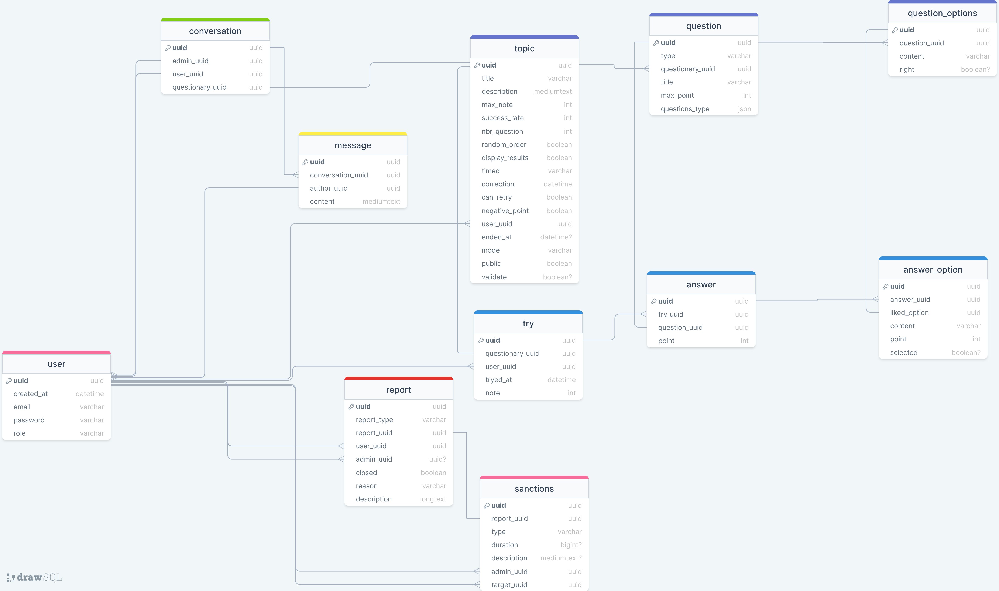

# Quizz Application backend

## Dependencies

- [sanctum](http://sanctum.app/)
- matomo/device-detector


## Install and launch

##### Install composer deps
```bach
composer install
```
<br>

#####  Copy env file
```bach
cp .env.example .env
```
<br>

##### Generate laravel key
```bach
php artisan key:generate
```
<br>

#####  Connect database
In .env file adding your database credential 
<br>

#####  Launch application
```bach
php artisan serve
```

## SQl Diagram


## Open Api Documentation


## License

The Laravel framework is open-sourced software licensed under the [MIT license](https://opensource.org/licenses/MIT).

## Contributing

Thank you for considering contributing to the Laravel framework! The contribution guide can be found in the [Laravel documentation](https://laravel.com/docs/contributions).

## Security Vulnerabilities

If you discover a security vulnerability within Laravel, please send an e-mail to Taylor Otwell via [taylor@laravel.com](mailto:taylor@laravel.com). All security vulnerabilities will be promptly addressed.

